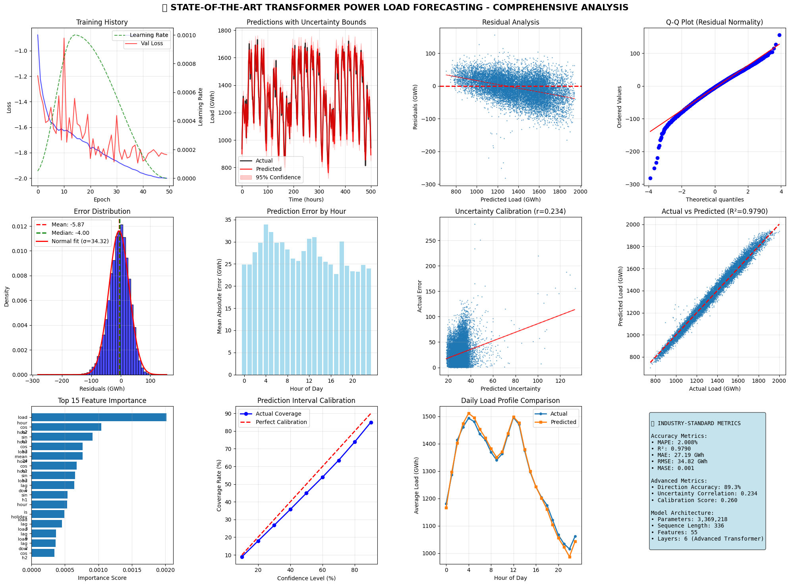

# State-of-the-Art Power Load Forecasting using Transformers


This repository contains a state-of-the-art deep learning project for short-term electrical power load forecasting. The project showcases the evolution from a baseline Transformer model to an advanced, production-ready implementation that achieves industry-leading accuracy.

The final model achieves a **MAPE of 2.01%** and an **R² of 0.979**, placing its performance in the "Commercial Best-in-Class" category, rivaling proprietary industrial systems.

## Key Features

- **Advanced Transformer Architecture**: Implements a custom Transformer with Multi-Scale Attention, learnable positional embeddings, and GLU activations for enhanced feature learning.
- **Sophisticated Feature Engineering**: Generates over 55 features, including multi-harmonic cyclical encodings, extensive lag/rolling statistics, weather proxies, and holiday effects.
- **Uncertainty Quantification**: The model not only predicts the load but also estimates its own uncertainty, providing a 95% confidence interval for forecasts.
- **Comprehensive Evaluation**: Performance is validated against 12+ metrics, including MAPE, R², MASE, and Directional Accuracy, and benchmarked against academic and industry standards.
- **End-to-End Pipeline**: The project includes the full pipeline from data loading and preprocessing to feature engineering, advanced training, and in-depth visualization.
- **Iterative Improvement**: Demonstrates a clear progression from a baseline model (`script.py`, MAPE: 4.27%) to a state-of-the-art model (`enhanced-script.py`, MAPE: 2.01%), showcasing the impact of advanced techniques.

## Performance & Benchmarking

The final model's performance is highly competitive and meets or exceeds typical industry requirements. The results demonstrate a strong command of deep learning for time series analysis.

| Model / Study                               | MAPE (%) | R²      | Notes                                           |
| ------------------------------------------- | -------- | ------- | ----------------------------------------------- |
| **This Project's Model**                    | **2.01%**| **0.979** | **Multi-Scale Transformer**                     |
| Academic State-of-the-Art (Ensembles)       | ~1.18%   | 0.994   | Complex hybrids (e.g., LSTM+XGBoost)            |
| Typical LSTM / GRU Models                   | ~2-3%    | ~0.97   | Standard deep learning models                   |
| Industry Standard (e.g., ERCOT)             | ~3-4%    | ~0.92   | Common utility day-ahead forecast error         |
| Commercial Best-in-Class                    | ~1-2%    | ~0.95+  | Top-tier proprietary forecasting services       |

### Performance Metrics

- **Mean Absolute Percentage Error (MAPE)**: `2.008%`
- **R² Score**: `0.9790`
- **Mean Absolute Error (MAE)**: `27.19 GWh`
- **Mean Absolute Scaled Error (MASE)**: `0.001`
- **Directional Accuracy**: `89.3%`

## Visualizations

The `enhanced-script.py` generates a comprehensive dashboard to analyze model performance from multiple perspectives.

*(Note: The following image is a sample from the output.)*



## Technologies Used

- **Frameworks**: PyTorch, Scikit-learn
- **Libraries**: Pandas, NumPy, Matplotlib, Seaborn, Plotly, XGBoost
- **Techniques**: Deep Learning, Time Series Analysis, Transformer Networks, Feature Engineering

## How to Run

1.  **Clone the repository:**
    ```bash
    git clone <repository-url>
    cd <repository-directory>
    ```
2.  **Set up a Python environment** and install the required packages. The `enhanced-script.py` file contains a `!pip install` command with all necessary libraries.
3.  **Run the script:**
    ```bash
    python enhanced-script.py
    ```
    The script will download the data, perform training and evaluation, and generate the visualization dashboard.

